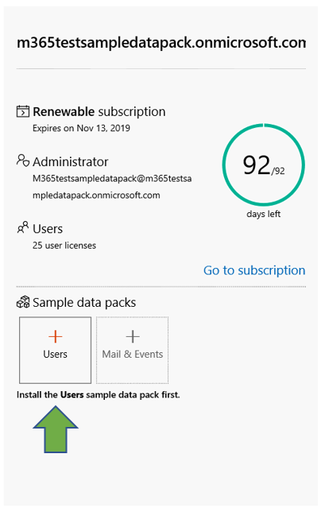
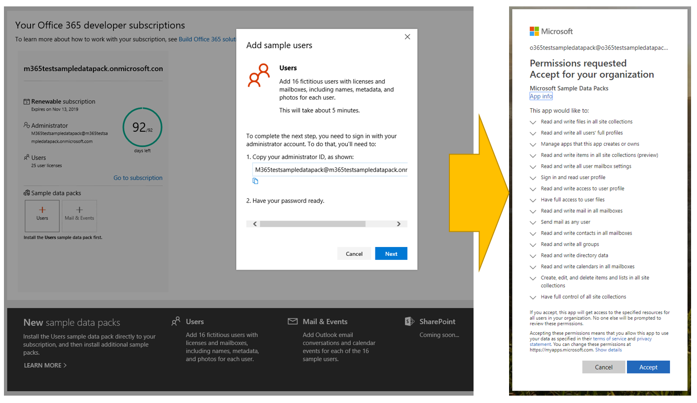
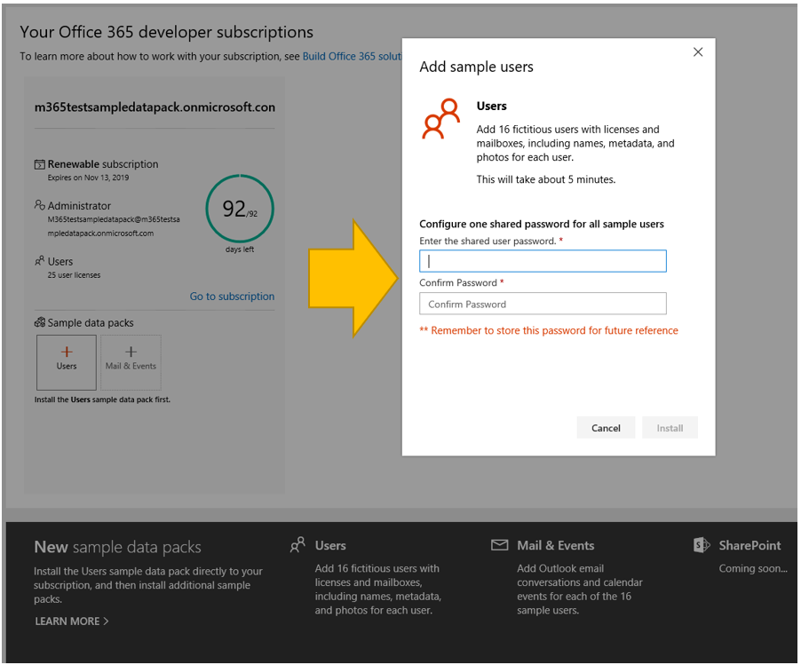
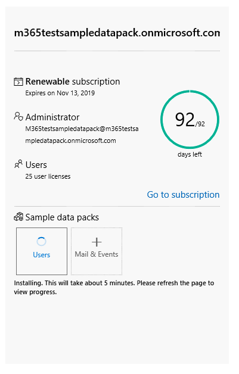
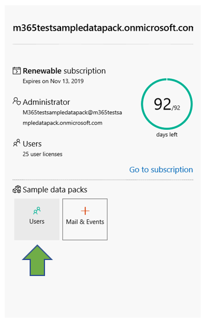
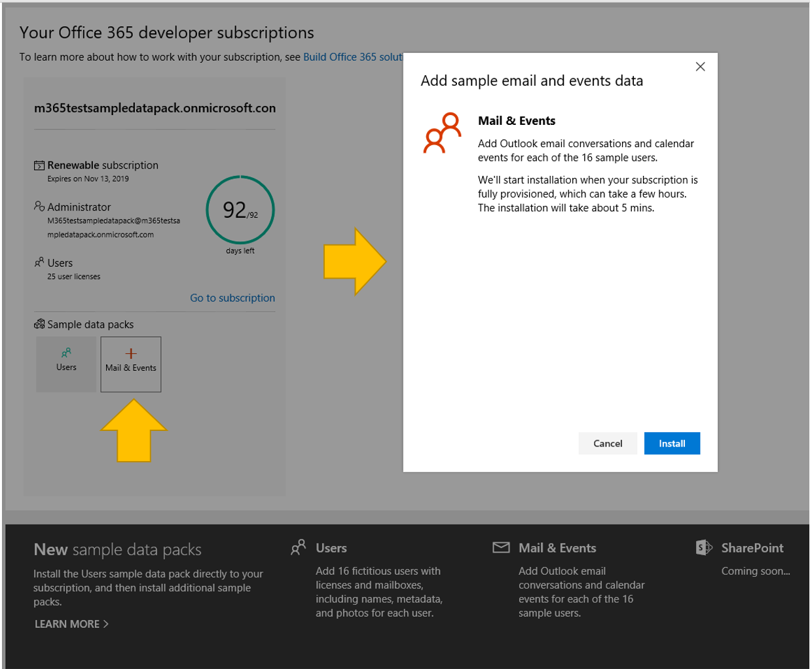
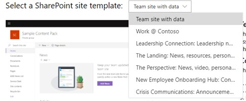

# Use sample data packs with your Microsoft 365 Developer Program subscription

You can install sample data packs on your Microsoft 365 Developer Program subscription. Sample data packs save you time by automatically installing data and content you need to build and test your solutions. This includes fictitious users, metadata, and photos to simulate a small corporate environment. You can quickly install the sample data so that you can focus on your solutions rather than spend time creating sample data yourself.

You can find sample data packs on your [Microsoft 365 Developer Program dashboard](https://developer.microsoft.com/office/profile), at the bottom of your subscription tile.

The following sample data packs are currently available:

- Users - Installs 16 fictitious users with licenses, mailboxes, and metadata, including names and photos for each user. Use Microsoft Graph APIs to work with user sample data in the following ways:
  - Get specific user details
  - Update user
  - Get direct reports
  - Prepare organization chart  
  - Get users by department

- Mail and events - Adds Outlook email conversations and calendar events for each of the 16 sample users. Use Microsoft Graph APIs to work with mail and events sample data in the following ways:
  - Get emails by users
  - Get emails filtered by date
  - Get upcoming events
  - Update/delete upcoming events

> [!NOTE]
> You must install the Users sample data pack before you install Mail and Events.

## What do the sample data packs add to my subscription?

The Users sample data pack creates 16 fictitious users on your subscription, and includes the licenses for each user, and mailboxes, names, metadata, and photos for each.

The Mail and Events sample data pack adds Outlook email conversations and calendar events for each of the 16 users installed.

## How do I install the Users sample data pack?

Before you install the Users sample data pack, make sure that you have a Microsoft 365 developer subscription and that you assign a license to yourself as the admin.

> [!NOTE]
> Make sure that you have 16 users available in your subscription. Your subscription includes 25 users. If you have already configured more than 10 users, remove some users first to ensure that your installation is successful.

To install the Users sample data pack:

1. Select the **Users** box at the bottom of your subscription tile.
2. Copy your administrator ID; you will need it to sign in to your subscription.
3. Enter your administrator ID and password on the sign in page.
4. Consent to the permissions as an administrator of your Microsoft 365 developer subscription.

5. Configure your passwords for all sample users. You will need to have one shared password defined for easy administration of all your fictitious users.

6. The data will be installed. The installation should take about 5 minutes.

7. When installation is finished, you'll be notified by email, and the box on your subscription tile will be green. You can now install the Mail and Events sample data pack.

## How do I install the Mail and Events sample data pack?

After you've installed the Users sample data pack, you can install mail and events.

1. Choose the **Mail &amp; Events** box on your subscription tile.
2. Select **Install** to begin installation.

> [!NOTE]
> If you just created your subscription, it must be fully provisioned before installation can begin. This can take up to a few hours. After installation starts, it can take up to 20 minutes to finish.

3. When installation is finished, you'll be notified by email, and the box on your subscription tile will be green.

## How do I install the SharePoint sample data pack?

The SharePoint sample data pack includes seven different SharePoint site templates to choose from to experience and model SharePoint solutions for collaboration, communication, engagement, and knowledge management.

These are some of the most popular templates from the [SharePoint PnP look book](https://provisioning.sharepointpnp.com/). Today, it's simple to create sample solutions of beautiful, fast sites and pages that look great on any device or screen. Get inspired with these designs or add them to your sandbox tenant to start building your next site.

The templates can be installed on your subscription. After you install one template, you have the option to install the others. The installation process includes the following steps:

1. Select the Template you want from the drop down menu.

  

2. Configure custom options for your sites, or accept the default values.
3. Use the administrator ID of your sandbox tenant and password to authenticate and give permissions to install. 

Installation will proceed automatically.

>**Note:** The provisioning of these site templates only works with English Office 365 E3 or Microsoft 365 E5 developer subscriptions, and all content included is English only.

## What SharePoint templates are available?

The SharePoint sample pack includes seven different templates.

### Team site with data

The Team site with data template includes multiple lists and document libraries that are automatically associated with a SharePoint team site to help you develop solutions using SharePoint Framework, Power Apps, and Microsoft Graph.

This template includes the following data:

- A contact list with pre-populated contacts
- A list populated with over 6,000 items
- Document libraries with sample PowerPoint, Excel, Word, and OneNote documents
- An events list with announcement items

This template integrates with the Users sample data.

### Work @ Contoso
The Work @ Contoso template consists of multiple site collections that are all automatically associated with the hub site to show how all default aggregation capabilities work.

This template contains following structures and assets:

- Main site collection set as a hub site
- Two communication sites associated with the hub site - Benefits and charity sites
- One group team site associated with the hub site - Team site
- Sample news articles in the subsite collections
- Sample Word, Excel, and PowerPoint files
- Sample image content used in the site collections

Subsite collections use the same templates, which you can also provision separately from this service.

>**Note:** If this template is applied on top of an existing communication site, the welcome page content of the site will be overwritten.

### Leadership Connection: Leadership news, events, engagement

This leadership site provides insight into the goals and priorities of the leadership team, and inspires engagement with events and conversations.

Adding this design to your tenant will create the following content:

- Example welcome page with demonstration of web parts
- Example news articles demonstrating different modern page designs

This template integrates with the Users sample data.

### The Landing: News, resources, personalized content

This communication site is designed to be the place where your employees can find the news and resources they need, plus personalized content tailored just for them.

Adding this design to your tenant will create the following content:

- Demo structure for home site of the portal
- Custom welcome page structure
- Six additional sample modern pages and news articles
- Sample images and Office documents

### The Perspective: News, video, personalized content

Designed to offer news and personalized content, this site also includes videos to inspire even more engagement.
Adding this design to your tenant will create the following content:

- Custom welcome page designs
- Sample page template for news articles
- 12 sample news articles

### New Employee Onboarding Hub: Connect, Engage, Inform

Streamline and refine your new employee onboarding process with pre-built templates that cover Pre-onboarding, Corporate-level onboarding, and Departmental-level onboarding scenarios. This digital solution offers four different site templates that contain pre-populated content that can be customized to align with the goals of your organization.

Adding this design to your tenant will create the following content:

- Pre-onboarding site, Corporate onboarding site, and two Departmental onboarding sites
- Custom and pre-populated home pages for each site
- Configured hub site for Corporate onboarding and associated sites for Departmental onboarding
- New employee checklist built on SharePoint Lists to help new hires onboard successfully
- Example content for the People web part, Yammer web part, News web part, and Quick links web part
- Pre-written FAQs for each site
- Recommendations for creating social and engaging experiences, like including a welcome video using the YouTube web part on the Pre-onboarding site

### Crisis Communications: Announcements, news, resources, communities and calls-to-action

Keep people informed, engaged, and moving forward during crises, from extreme weather events to health and safety emergencies. This template creates a central resource for leaders and communicators to share important news and announcements, a single source of truth where people can stay up-to-date, and a place to connect people across the organization.

Adding this design to your tenant will create the following content:

- Custom welcome page built using a web part
- Four news articles with example content

This template integrates with the Users sample data.

## Are more sample data packs coming?

Yes. In the future, we will consider adding sample data packs for more products and technologies, including Microsoft Teams. If you have suggestions for sample data packs that you would like to see, [let us know](https://officespdev.uservoice.com/forums/224641-feature-requests-and-feedback?category_id=171306).

## Can I install sample data packs on my other Microsoft 365 subscriptions?

No. These sample data packs are only compatible with the Microsoft 365 developer subscription you get as part of the Microsoft 365 Developer Program.

## How can I see the sample data in my subscription?

After you install the Users sample data pack, to see the users that were added, go to the **Microsoft 365 Admin Center** on your Microsoft 365 developer subscription. Under **Users**, select **Active users**. You will see the list of 16 users. You can select a user to view the associated metadata, including photos and licenses.

After you install the Mail and Events sample pack, to see the sample data, in the **Microsoft 365 Admin Center**, choose **Show all** and then select **Exchange**. In the Exchange admin center, when you select **recipients**, you can see that each of the 16 users has mailboxes with mail and events added.

## See also

- [Set up a Microsoft 365 developer subscription](microsoft-365-developer-program-get-started.md)
