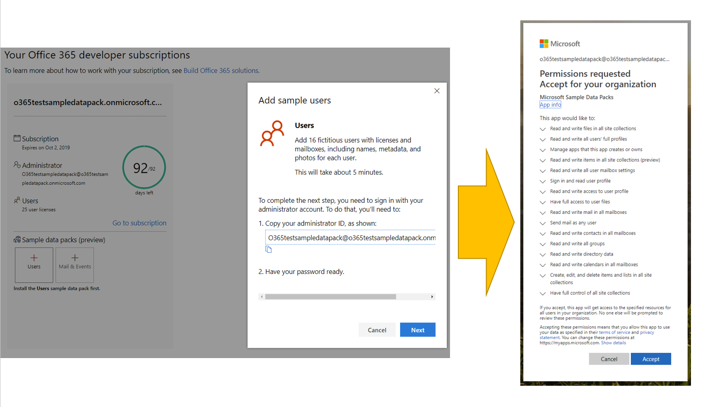
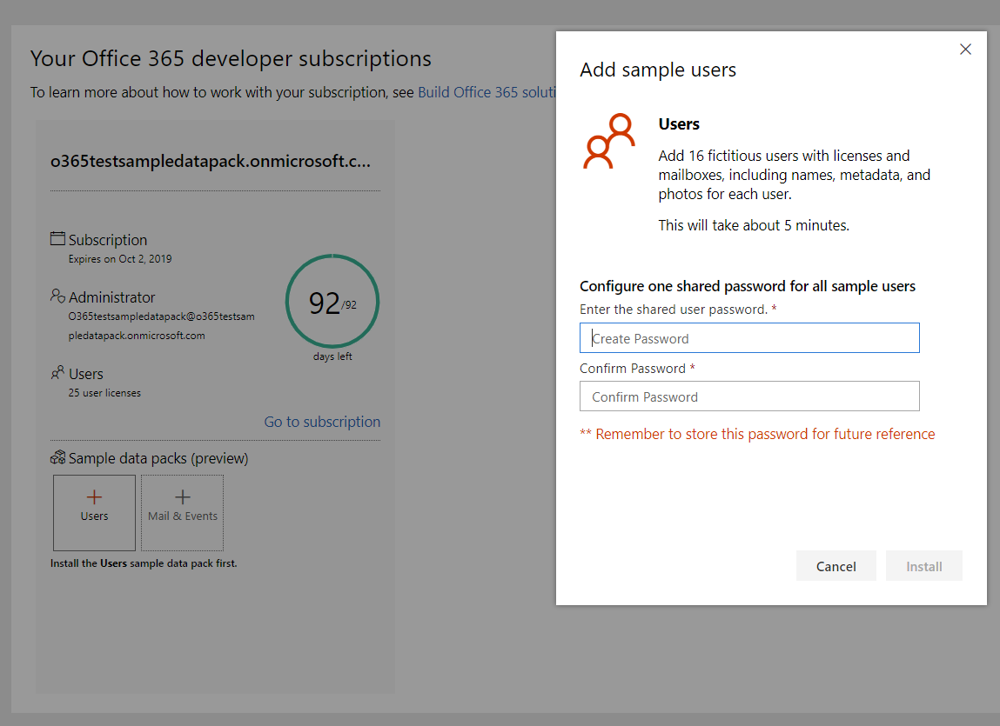
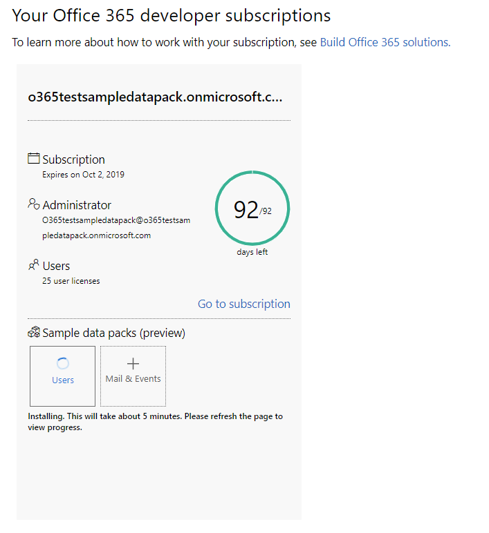
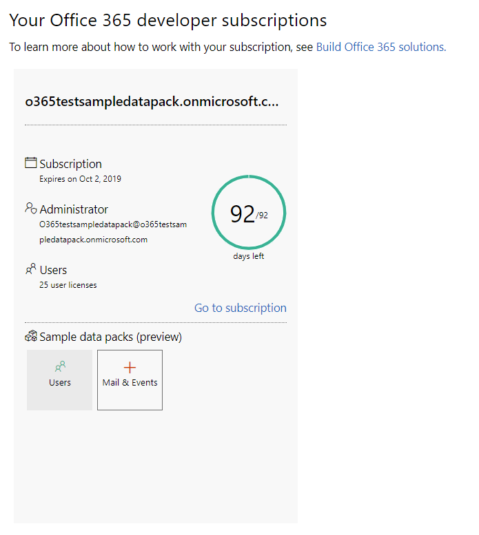
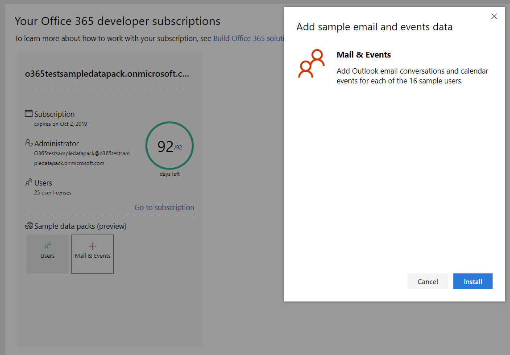

## Use sample data packs with your Office 365 developer subscription

You can install sample data packs on your Office 365 developer subscription
Sample data packs save you time by automatically installing data and content you need to build and test your solutions. This includes fictitious users, metadata, and photos to simulate a small corporate environment. You can quickly install the sample data so that you can focus on your solutions rather than spend time creating sample data yourself.

You can find sample data packs on your [Office 365 Developer Program dashboard](https://developer.microsoft.com/office/profile), at the bottom of your Office 365 subscription tile.

The following sample data packs are currently available:

- Users - Installs 16 fictitious users with licenses, mailboxes, and metadata, including names and photos for each user. Use Microsoft Graph APIs to work with user sample data in the following ways:
  - Get specific user details
  - Update user
  - Get direct reports
  - Prepare organization chart  
  - Get users by department

- Mail and events - Adds Outlook email conversations and calendar events for each of the 16 sample users. Use Microsoft Graph APIs to work with mail and events sample data in the following ways:
  - Get emails by users
  - Get emails filtered by date
  - Get upcoming events
  - Update/delete upcoming events

### What do the sample data packs add to my Office 365 subscription?

The Users sample data pack, which you install first, creates 16 fictitious users on your subscription, and includes the licenses for each user, and mailboxes, names, metadata, and photos for each.

The Mail and Events sample data pack adds Outlook email conversations and calendar events for each of the 16 users installed.

### How do I install the Users sample data pack?

You must install the Users sample data pack first. Before you install the Users sample data pack, make sure that you have an Office 365 developer subscription and that you assign a license to yourself as the admin.

To install the Users sample data pack:

1. Select the **Users** box at the bottom of your subscription tile.
2. Copy your administrator ID; you will need it to sign in to your subscription.
3. Enter your administrator ID and password on the sign in page.
4. Consent to the permissions as an administrator of your Office 365 developer subscription.

5. Configure your passwords for all sample users. You will need to have one shared password defined for easy administration of all your fictitious users.

6. The data will be installed. The installation should take about 5 minutes.

7. When installation is finished, you'll be notified by email, and the box on your subscription tile will be green. You can now install the Mail and Events sample data pack.

### How do I install the Mail and Events sample data packs?

After you've installed the Users sample data pack, you can install mail and events.

1. Choose the **Mail &amp; Events** box on your subscription tile.
2. Select **Install** to begin installation.

> [!NOTE]
> If you just created your subscription, it must be fully provisioned before installation can begin. This can take up to a few yours. After installation starts, it can take up to 20 minutes to finish.

3. When installation is finished, you'll be notified by email, and the box on your subscription tile will be green.

### Are more sample data packs coming?

Yes. We will add sample data packs for SharePoint and OneDrive. In the future, we will consider adding sample data packs for more products and technologies, including Office Add-ins, Microsoft Teams, and more.

### Can I install sample data packs on my other Office 365 subscriptions?

No. These sample data packs are only compatible with the Office 365 Developer Subscription you get as part of the Office 365 Developer Program.
