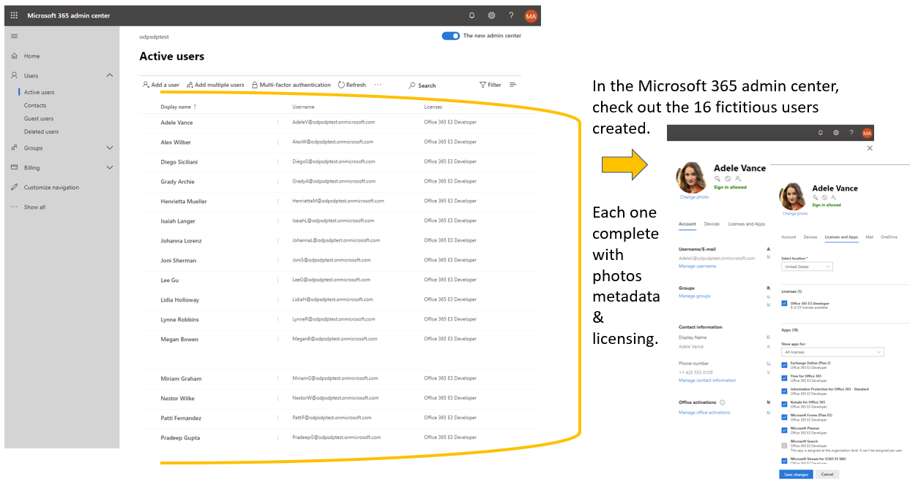
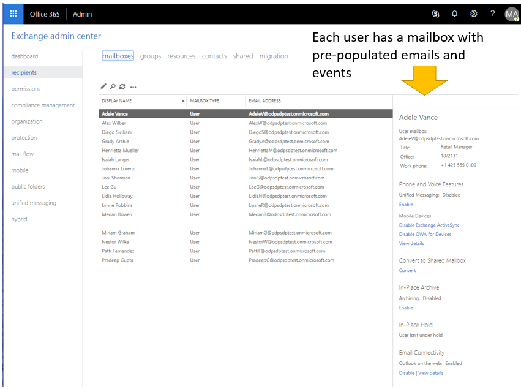

---

title: Developer sandbox sample data
description: Learn about the sample data packs included with your Microsoft 365 Developer Program sandbox subscription.
ms.date: 07/30/2026
ms.localizationpriority: high

---

# Developer sandbox sample data

Your Microsoft 365 Developer Program sandbox subscription comes with sample data to save you time by providing data and content you need to build and test your solutions.

## Sample data installed on your instant sandbox

Sample data packs are pre-installed on your instant sandbox. Your sandbox includes the following sample data:

- **Microsoft Graph user, mail, and calendar data** - 16 sample users with user data and content to help you model your solutions. This includes user mailboxes, calendar events, and integration into a Teams developer environment with simulated chats and team memberships.
- **Teams sample data** pack with the following customized developer environment:
  - **App sideloading** pre-configured
  - **Five sample teams, channels, tabs, and chat sessions** built around the 16 sample users.
  - **App Studio / Teams Developer Portal pre-installed and pinned** to help you streamline the creation of your Teams app manifest and app package, plus the card editor and a React control library.

The following sample data packs are included:

- **Users** - 16 fictitious users with licenses, mailboxes, and metadata, including names and photos for each user. Use Microsoft Graph APIs to work with user sample data in the following ways:
  - Get specific user details
  - Update user
  - Get direct reports
  - Prepare organization chart
  - Get users by department
- **Mail & events** - Outlook email conversations and calendar events for each of the 16 sample users. Use Microsoft Graph APIs to work with mail and events sample data in the following ways:
  - Get emails by users
  - Get emails filtered by date
  - Get upcoming events
  - Update/delete upcoming events

## Can I install sample data packs on my other Microsoft 365 subscriptions?

No. These sample data packs are only compatible with the Microsoft 365 developer subscription you get as part of the Microsoft 365 Developer Program.

## How can I see the sample data in my subscription?

To see the Users sample data, go to the [**Microsoft 365 Admin Center**](https://admin.microsoft.com/) on your Microsoft 365 developer subscription. Under **Users**, select **Active users**. You will see the list of 16 users. You can select a user to view the associated metadata, including photos and licenses.

To see the Mail & Events sample data, in the [**Microsoft 365 Admin Center**](/microsoft-365/admin/admin-overview/about-the-admin-center), choose **Show all** and then select **Exchange**. In the Exchange admin center, when you select **recipients**, you can see that each of the 16 users has mailboxes with mail and events added.

To see the Microsoft Teams sample data, go to **Teams** in your Microsoft 365 E5 subscription. On the Teams tab, you'll see some pre-created teams with chats from sample users in the **Mark 8 Project Team**. The App Studio/Dev Portal app is pre-installed and pinned to the navigation pane.

## Related content

- [Set up a Microsoft 365 developer sandbox subscription](microsoft-365-developer-program-get-started.md)
