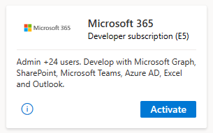

# Join the Microsoft 365 Developer Program as a Visual Studio subscriber

Visual Studio Professional and Enterprise subscribers qualify for a Microsoft 365 E5 developer subscription that renews automatically, regardless of activity signals, for as long as you remain a subscriber. When you join the program as a Visual Studio subscriber, you can set up a developer sandbox subscription that is linked to your Visual Studio subscription, and it will not be subject to expiration due to inactivity (or our failure to detect activity that is not be in scope for our renewal monitoring).

> [!NOTE]
> Your Microsoft 365 E5 developer subscription is for development purposes only and can be revoked if you use it for purposes other than development. For details, see the [Microsoft 365 Developer Program Terms and Conditions](terms-and-conditions.md).

## How do I get a renewable Microsoft 365 developer subscription?

If you don't have a Visual Studio Professional or Enterprise subscription and you want one, see the [Visual Studio subscription](https://visualstudio.microsoft.com/vs/pricing/) page.

If you already have a Visual Studio Professional or Enterprise subscription, after you join the program, when you set up your Microsoft 365 developer subscription, you have the option to link it to your Visual Studio subscription. For details, see [Set up your Microsoft 365 E5 sandbox subscription](microsoft-365-developer-program-get-started.md#set-up-your-microsoft-365-e5-sandbox-subscription).

You can also join the Microsoft 365 Developer Program and get a Microsoft 365 developer subscription from your Visual Studio subscriber portal. Go to [Visual Studio | My Benefits](https://my.visualstudio.com/benefits) and click the **Microsoft 365 Developer subscription (E5)** tile, and you will automatically join the Microsoft 365 developer program with your Visual Studio ID. 

> [!NOTE] 
> If you have already set up your Microsoft 365 developer subscription, you can link it to an active Visual Studio subscription. On the subscription tile on your [Developer Program dashboard](https://developer.microsoft.com/en-us/microsoft-365/profile), click **Link with your Visual Studio subscription**.

When you link your Microsoft 365 developer subscription to Visual Studio, it will renew automatically for as long as your Visual Studio subscription is active.

## What is the difference between joining the program directly and joining with my Visual Studio subscription?

When you join the Microsoft 365 Developer Program with your Visual Studio subscription, your Microsoft 365 E5 developer sandbox subscription will automatically renew for the lifetime of your Visual Studio subscription. 

If you join the developer program directly, your Microsoft 365 E5 developer sandbox subscription is good for 90 days and will renew regularly based on your development activity.
