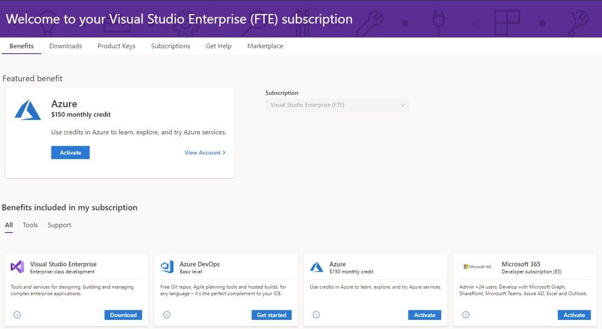

# Join the Microsoft 365 Developer Program with a Visual Studio Professional or Enterprise subscription

All new members of the Microsoft 365 Developer Program (including Visual Studio Professional and Enterprise subscribers) can sign up for a Microsoft 365 E5 developer subscription (Windows not included). 

Select Visual Studio Professional or Enterprise standard subscriptions include access to the Microsoft 365 developer subscription benefit for as long as the subscriptions are active. Your paid Visual Studio Professional or Enterprise subscription grants you a free renewable Microsoft 365 developer subscription with up to 25 users. This can be helpful when you want to create your own sandbox outside of your corporate domain for development and testing purposes.

This also grants you special status in the Microsoft 365 Developer Program. Your subscription will be renewed automatically for as long as you have a valid Visual Studio Professional or Enterprise subscription.

## How do I get a renewable Microsoft 365 developer subscription?

If you don’t have a Visual Studio Professional or Enterprise subscription and you want one, see the [Visual Studio subscription](https://visualstudio.microsoft.com/vs/pricing/) page.

If you already have a Visual Studio Professional or Enterprise subscription, you can get a Microsoft 365 developer subscription from your Visual Studio subscriber portal. Go to [https://my.visualstudio.com](https://my.visualstudio.com) and click the **Microsoft 365 Developer subscription (E5)** tile, and you will automatically join the Microsoft 365 developer program with your Visual Studio ID.

## What is the difference between joining the Microsoft 365 Developer Program directly and joining with my Visual Studio Pro or Enterprise subscription?
