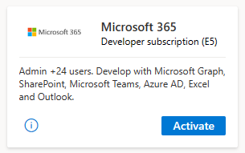

# Join the Microsoft 365 Developer Program as a Visual Studio subscriber

If you have an eligible Visual Studio Professional standard or Visual Studio Enterprise standard subscription, you qualify for a Microsoft 365 E5 developer subscription that renews automatically while your eligible Visual Studio subscription remains active. When you join the program as a Visual Studio subscriber, you can set up a developer sandbox subscription that is linked to your Visual Studio subscription. It will not be subject to expiration due to inactivity (or our failure to detect activity that is not in scope for renewal monitoring).

> [!IMPORTANT]
> **Microsoft employees aren't eligible to request or provision a Microsoft 365 E5 developer sandbox through the Microsoft 365 Developer Program.** This compliance restriction applies to Microsoft employees even if they have a Visual Studio Professional standard or Visual Studio Enterprise standard subscription.

> [!NOTE]
> Your Microsoft 365 E5 developer subscription is for development purposes only and can be revoked if you use it for purposes other than development. For details, see the [Microsoft 365 Developer Program Terms and Conditions](terms-and-conditions.md).

> [!NOTE]
> Visual Studio subscribers go through the same instant sandbox setup as any other qualifying Developer Program member. See [Set up a Microsoft 365 developer sandbox subscription](microsoft-365-developer-program-get-started.md).
>
> The only difference is that you can link your subscription to Visual Studio for automatic renewal, as described below.
>
> If your sandbox has add-on commerce capability enabled, you can purchase eligible add-ons (such as Microsoft 365 Copilot) just like any other commercially enabled sandbox.

## How do I get a renewable Microsoft 365 developer subscription?

> [!NOTE]
> Only Visual Studio "standard" type subscriptions are eligible.
> You must have either a Visual Studio Professional standard or Visual Studio Enterprise standard subscription to receive an automatically renewable Microsoft 365 E5 developer subscription. 
> Monthly Visual Studio subscriptions (such as "Professional monthly" or "Enterprise monthly") are not eligible.
>

If you don't have a Visual Studio standard Professional or Enterprise subscription and you want one, see the [Visual Studio subscription](https://visualstudio.microsoft.com/vs/pricing/) page.

If you already have a Visual Studio standard Professional or Enterprise subscription, after you join the program, when you set up your Microsoft 365 developer subscription, you have the option to link it to your Visual Studio subscription. For details, see [Set up your Microsoft 365 E5 sandbox subscription](microsoft-365-developer-program-get-started.md#set-up-your-microsoft-365-e5-sandbox-subscription).

You can also join the Microsoft 365 Developer Program and get a Microsoft 365 developer subscription from your Visual Studio subscriber portal. Go to [Visual Studio | My Benefits](https://my.visualstudio.com/benefits) and click the **Microsoft 365 Developer subscription (E5)** tile, and you will automatically join the Microsoft 365 Developer Program with your Visual Studio ID.

> [!NOTE]
> If you have already set up your Microsoft 365 developer subscription, you can link it to an active Visual Studio subscription. On the subscription tile on your [Developer Program dashboard](https://developer.microsoft.com/en-us/microsoft-365/profile), click **Link with your Visual Studio subscription**.

When you link your Microsoft 365 developer subscription to Visual Studio, it will renew automatically for as long as your Visual Studio subscription is active.

## What is the difference between joining the program directly and joining with my Visual Studio subscription?

When you join the Microsoft 365 Developer Program with your Visual Studio subscription, your Microsoft 365 E5 developer sandbox subscription will automatically renew for the lifetime of your Visual Studio subscription.

If you join the developer program directly, your Microsoft 365 E5 developer sandbox subscription is good for up to 90 days, depending on your development activity, and will renew regularly for as long as you use it for qualified activities.

In both cases, sandbox setup, sample data, and add-on purchase capability (where enabled) are the same — see [Set up a Microsoft 365 developer sandbox subscription](microsoft-365-developer-program-get-started.md). Renewal behavior is the only difference.
