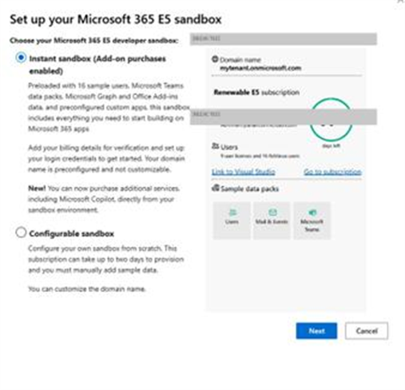
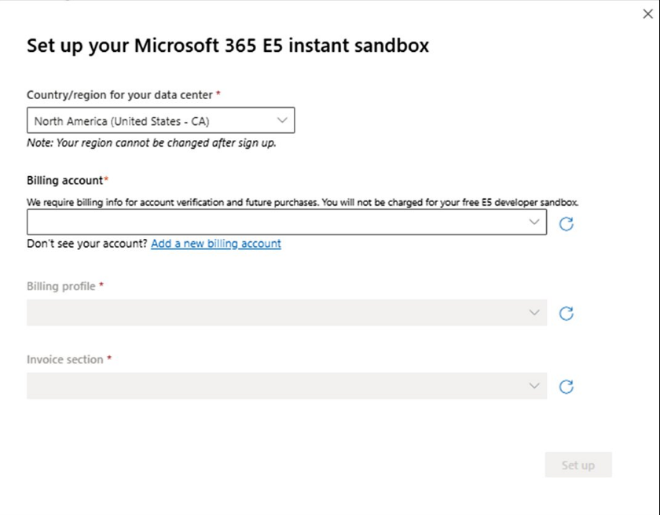
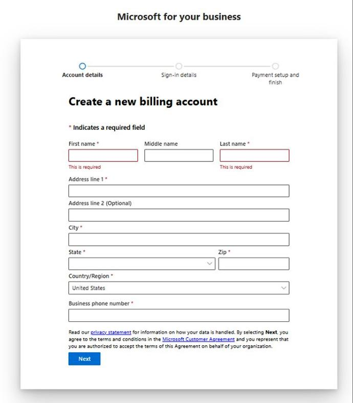
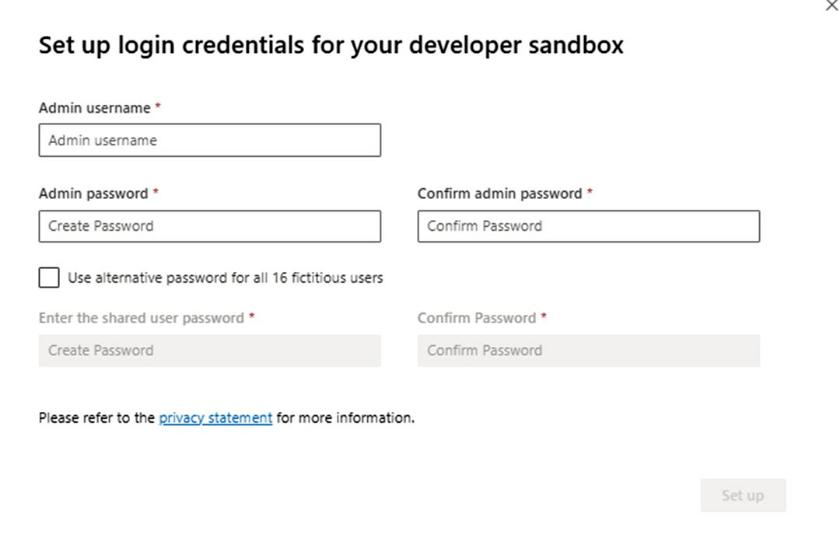
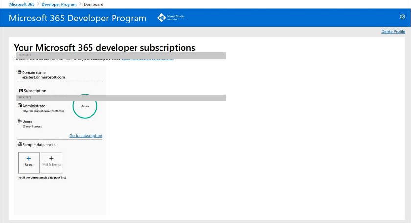

# Set up a Microsoft 365 developer sandbox subscription 

Qualifying Microsoft 365 Developer Program members can set up a Microsoft 365 E5 developer subscription for use in building solutions independent of your production environment. The Microsoft 365 E5 developer sandbox subscription includes 25 user licenses and lasts for up to 90 days, depending on your activity. If you use your subscription for valid development activity, it will renew automatically.

> [!NOTE]
> Instant sandboxes issued to eligible customers with enterprise accounts starting July 2026 include add-on commerce capability, so you can purchase additional paid licenses and services including Microsoft 365 Copilot directly from within the sandbox. See [Purchase add-on services] below.

> [!IMPORTANT]
> Before you request a developer subscription, you must first [join the Microsoft 365 Developer Program](microsoft-365-developer-program.md) directly or through Visual Studio Professional or Enterprise (if you're a subscriber). 

If you qualify for a Microsoft 365 E5 subscription through the developer program, the subscription set up flow will start automatically after you join the program. If you choose not to set up your subscription right away, the option to set up a subscription will be available on your [Microsoft 365 Developer Program dashboard](https://developer.microsoft.com/en-us/microsoft-365/profile).

> [!IMPORTANT]
> Your Microsoft 365 E5 developer subscription is for development purposes only and can be revoked if you use it for purposes other than development. For details, see the [Microsoft 365 Developer Program Terms and Conditions](terms-and-conditions.md).

## Billing account requirement

> [!IMPORTANT]
> **A valid billing account is required to set up a Microsoft 365 E5 developer sandbox. This requirement can't be bypassed.**
>
> The billing account is used for verification and to enable future paid purchases. You will not be charged for the developer sandbox. Charges are incurred only if you intentionally purchase a paid product or service.
>
> You can use an eligible individual billing account or, if you have the required permissions, an existing organizational billing account. Before you begin, make sure that the [Microsoft Customer Agreement](/azure/cost-management-billing/understand/mca-overview#check-access-to-a-microsoft-customer-agreement) is accepted, an [Azure plan](/azure/cost-management-billing/understand/mca-overview#azure-plans-determine-pricing-and-service-level-agreement-for-subscriptions) is enabled, the [billing profile and invoice section](/azure/cost-management-billing/understand/mca-overview#your-billing-account) are active, and any applicable [Azure subscription spending limit](/azure/cost-management-billing/manage/spending-limit#remove-the-spending-limit-in-azure-portal) is removed.
>
> If your MCA billing account doesn't have an Azure plan, create an invoice section. This action might provision the required Azure plan. For instructions, see [Organize your invoice based on your needs](/azure/cost-management-billing/manage/mca-section-invoice). For all billing requirements, see [Configure billing details](#step-2-configure-billing-details).

## Instant sandbox

Your Microsoft 365 developer subscription is provisioned as an instant sandbox, a fully pre-configured E5 developer environment that's ready in minutes. It comes pre-loaded with:

- 16 fictitious sample users (plus your admin account)
- Microsoft Teams sample data packs
- Microsoft Graph user, mail, and calendar data, and Office Add-ins/SharePoint Framework sample data
- Pre-configured custom apps
- Add-on commerce capability — the ability to purchase additional services, including Microsoft 365 Copilot, directly from your sandbox

For details on the sample data, see [Developer sandbox sample data](install-sample-packs.md).

> [!VIDEO b716d805-224b-4934-958a-76d8790ff797]

> [!NOTE]
> Your domain name is pre-configured (for example, yourtenant.onmicrosoft.com) and can't be customized after sign-up.

## Set up your Microsoft 365 E5 sandbox subscription

### Prerequisites

Before you begin, make sure you have:

- A Microsoft account to sign in with.
- A valid individual or organizational billing account.
- A business phone number and address, for billing account creation.

### Step 1: Choose your sandbox type

1. On your profile page, choose **Set up E5 subscription**.

2. In the setup dialog box, select **Instant sandbox (Add-on purchases enabled)** — this is the default, top option.

3. Choose **Next** to continue to the billing setup screen.

What you get: Your domain name will be pre-configured (e.g., yourtenant.onmicrosoft.com) and cannot be customized after sign-up. The preview panel on the right shows the 90-day renewable subscription details.

### Step 2: Configure billing details

On the **Set up your Microsoft 365 E5 instant sandbox** screen, provide your data center region and link a billing account.

You can use either of the following billing account types:

- **Organizational billing account** — An existing account owned by your organization that you have permission to use.
- **Individual billing account** — An account that you own and manage, which you can create during sandbox setup.

If you don't have permission to use an organizational billing account, contact your organization's billing administrator.

The billing account must meet the following requirements:

- The Microsoft Customer Agreement (MCA) is accepted for an active billing account.
- The billing profile and invoice section are active and available for you to use.
- The Azure plan is enabled.
- The spending limit on any associated Azure subscription is removed.

1. **Select country/region.** Choose the data center region closest to you from the **Country/region for your data center** dropdown.

    > [!NOTE]
    > Your region can't be changed after sign-up, so choose carefully.

2. **Select a billing account.** Click the **Billing account** dropdown.
    - If you have permission to use an existing eligible individual or organizational billing account, select it and skip to step 4.
    - If the dropdown is empty or your account isn't listed, continue to step 3 to create one.

3. **Create a new individual billing account** (if required). Choose **Add a new billing account** to open the Microsoft billing account creation flow in a new window, and complete the three-step wizard:

   

    1. **Account details** — your name, business address, country/region, and business phone number.
    2. **Sign-in details** — confirm or set up sign-in credentials for the billing account.
    3. **Payment setup and finish** — review and accept the Microsoft Customer Agreement.

    > [!NOTE]
    > By selecting **Next**, you accept the Microsoft Customer Agreement and confirm that you are authorized to accept its terms for this billing account.

    Once billing account creation is complete, close that window and return to the sandbox setup screen.

4. **Refresh and select your billing account.** If you created a billing account or your existing account isn't listed, select the small **Refresh (↺)** icon next to the **Billing account** dropdown. Select the account that you want to link. The **Billing profile** and **Invoice section** fields populate automatically — verify that they're correct.

    > [!TIP]
    > If your account still does not appear after refreshing, wait a few seconds and try the refresh button again.

5. Choose **Set up**.

### Step 3: Set up admin credentials

After billing configuration is saved, set the sign-in credentials for your sandbox:

1. Provide an **Admin username**.

2. Create and confirm an **Admin password**.

3. Optionally, select **Use alternative password for all 16 fictitious users** to set one shared password for the sample user accounts — useful for testing scenarios where you need to sign in as different users.

    > [!IMPORTANT] 
    > Make a note of your username and password because you'll need them to access your developer subscription.

4. Choose **Set up** to begin provisioning your sandbox.

> [!NOTE]
> Please refer to the [Microsoft privacy statement](https://privacy.microsoft.com/privacystatement) for information on how your data is handled.

### Step 4: Access your sandbox dashboard

Once provisioning is complete, you'll be redirected to the Microsoft 365 Developer Program dashboard, where your new subscription appears with an **Active** status.

From here, you can:

- View your sandbox domain name and subscription status.
- Choose **Go to subscription** to access your sandbox.
- Install sample data packs (Users, Mail & events) — the Users pack must be installed first. For details, see [Developer sandbox sample data](install-sample-packs.md).
- Monitor your 90-day renewable subscription timer.

> [!TIP]
> If you're a Visual Studio subscriber, link your subscription to Visual Studio for automatic renewal. See [Join the Microsoft 365 Developer Program as a Visual Studio subscriber](join-with-visual-studio.md).

## Configure the subscription

1. On your profile page, choose **Go to subscription** and sign in with your user ID (for example, username@domain.onmicrosoft.com) and the password that you specified for your developer subscription.

   > [!NOTE] 
   > Do not sign in to your subscription with your Developer Program account ID.

2. Use the app launcher to go to the [Admin center](https://admin.microsoft.com/AdminPortal/Home#/homepage).

3. On the Admin center home page, choose **Go to guided setup**. This takes you to the **Microsoft 365 E5 Developer Setup** page.

4. **Install your Office apps**. You have the option of installing Office apps to your computer. When ready, choose **Continue**.

5. **Personalize your sign-in and email**. You can connect your subscription to a domain, or just use the existing subdomain that you created. When ready, choose **Use this domain**, or choose **Do this later**.

6. **Add new users**. You can add fictitious or real users to help you with development. When ready, choose **Add users and assign licenses**.

7. **Assign licenses to unlicensed users**. For any users that you want to be able to work with the subscription, grant them a license. When ready, choose **Add users and assign licenses** or **Do this later**.

8. **Share sign-in credentials**. For any real users that will access the subscription, you must share their sign-in credentials with them. You can choose a method, such as email, download, or print. When ready, choose **Continue**.

   > [!TIP] 
   > On subsequent visits to your dashboard, sign in with your *username@domain*.onmicrosoft.com account before you go to the Dashboard.

9. Choose whether you want to send an email to users about Microsoft Teams, and then choose **Continue**.

10. **You've reached the end of setup**. You've completed the setup for your subscription. You can optionally rate the experience. When ready, choose **Go to the Admin center**.

## Set up multifactor authentication

Set up multifactor authentication to safeguard your access to your sandbox. To set up multifactor authentication, sign in to your new sandbox with your admin account. In the left pane, choose **Admin**, choose **Setup**, and then choose **Configure multifactor authentication (MFA)**. Link the MFA to the email and phone number you used when you set up your sandbox. You will be able to use them to recover your sandbox if you forget your password.

## Install sample data packs

Sample data packs come pre-installed with your instant sandbox and save you time by automatically providing data and content you need to build and test your solutions. This includes fictitious users, metadata, and photos to simulate a small corporate environment. For details about the sample data packs available, see [Developer sandbox sample data](install-sample-packs.md).

## Set up a development environment and deployment pipeline

For resources to help you set up your development environment and deployment pipeline, engage with the [Microsoft 365 and Power Platform Community](https://pnp.github.io/).

## Troubleshooting

### Billing account not appearing in the dropdown

Choose the refresh icon next to the **Billing account** dropdown. Allow a few seconds after completing billing account creation before refreshing.

If the billing account still doesn't appear, or if the system shows **BillingAccountAlreadyExists** or displays "Your billing account is ready," check for the following:

#### You don't have permission to use an organizational billing account

An organizational billing account appears only if your signed-in account has permission to use the applicable billing profile and invoice section. Ask your organization's billing administrator to grant the required access, then refresh the billing account list.

For information about billing permissions, see [Billing roles for Microsoft Customer Agreements](/azure/cost-management-billing/manage/understand-mca-roles).

#### No Azure plan is enabled on the account

If you have a valid MCA billing account but no Azure plan is enabled on it, create an invoice section. This action might provision the required Azure plan.

For instructions, see [Organize your invoice based on your needs](/azure/cost-management-billing/manage/mca-section-invoice).

After the invoice section has been created and the Azure plan is available, attempt the setup again.

#### A spending limit is enabled

If a spending limit applies to the Azure subscription associated with the billing account, remove the spending limit, then retry sandbox setup. You must have the required billing permissions and a valid payment method to remove it.

For instructions, see [Azure spending limit](/azure/cost-management-billing/manage/spending-limit).

### Microsoft Customer Agreement not signed

If you see an error indicating that the Microsoft Customer Agreement hasn't been signed, an authorized user must accept the agreement in the [Microsoft 365 admin center](https://admin.microsoft.com) and create the required **billing profile** and **invoice section**.

Then retry sandbox setup. If the issue continues, contact [dxipsup@microsoft.com](mailto:dxipsup@microsoft.com) and provide a screenshot of the billing account page and the complete error message, including its correlation ID.

### Set up button remains unavailable

Make sure all required fields — **Billing account**, **Billing profile**, and **Invoice section** — have a value selected. All three must be set before **Set up** becomes active.

### Provisioning takes longer than expected

The instant sandbox typically provisions within minutes. If it takes longer, refresh the Developer Program dashboard page. If the issue persists, contact [dxipsup@microsoft.com](mailto:dxipsup@microsoft.com).

## Related content

- [Purchase Copilot licenses from your M365 Developer Program sandbox](purchase-copilot-licenses.md)
- [Use your subscription to build Microsoft 365 solutions](build-microsoft-365-solutions.md)
- [Microsoft 365 Developer Program FAQ](microsoft-365-developer-program-faq.yml)
