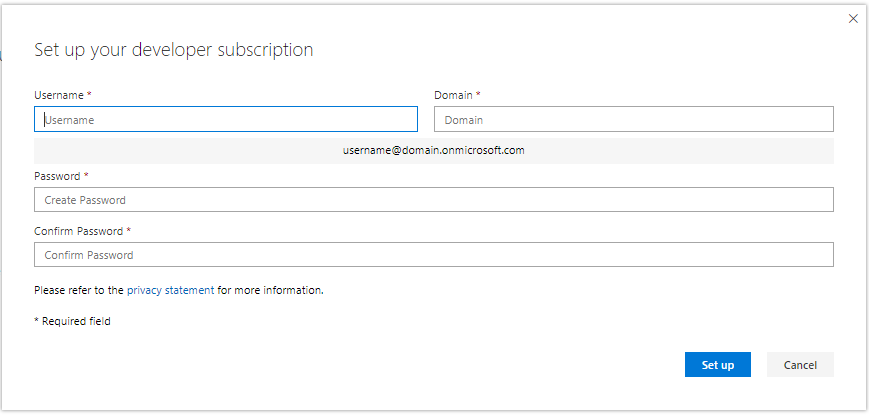

# Set up a Microsoft 365 developer sandbox subscription 

Set up a Microsoft 365 developer subscription to build your solutions independent of your production environment. The subscription is a Microsoft 365 E5 Developer subscription with 25 user licenses. It lasts for 90 days and is free to use for development purposes (coding solutions) only. 

> [!NOTE] 
> To set up a subscription, you must first [join the Microsoft 365 Developer Program](microsoft-365-developer-program.md) directly or through Visual Studio Profressional or Enterprise (if you're a subscriber). After joining, you'll see the option to set up a subscription.

## Set up your Microsoft 365 E5 sandbox subscription

1. To get a Microsoft 365 developer subscription, on your profile page, choose **Set up subscription**.

2. In the **Set up your developer subscription** dialog box, create a username and domain. This account will have global administrator permissions for the subscription. You can choose any username or domain name as long as it is not already in use. Do not use spaces.

  

3. Create and confirm a password.

4. Choose **Set up**.

5. If you are asked to prove that you're not a robot, follow the instructions, and then choose **Verify**.

6. After the subscription is created, your subscription name and expiration date appear on your profile page.

  > [!IMPORTANT]
  > Make a note of your username and password because you'll need it to access your developer subscription.

## Configure the subscription

1. On your profile page, choose **Go to subscription** and sign in with your user ID (for example, username@domain.onmicrosoft.com) and the password that you specified for your developer subscription.

   > [!NOTE] 
   > Do not sign in to your subscription with your Developer Program account ID.

2. Use the app launcher to go to the [Admin center](https://admin.microsoft.com/AdminPortal/Home#/homepage).

3. On the Admin center home page, choose **Go to setup**. This takes you to the **Microsoft 365 E5 Developer Setup** page.

4. **Personalize your sign-in and email**. You can connect your subscription to a domain, or just use the existing subdomain that you created. When ready, choose **Next**.

5. **Add new users**. You can add fictitious or real users to help you with development. When ready, choose **Next**.
    
  > [!NOTE]
  > After you set up your subscription, you can install the Users sample data pack. The Users sample data pack creates 16 fictitious users on your subscription, and includes the licenses for each user, and mailboxes, names, metadata, and photos for each. For details, see [Install sample data packs](install-sample-packs.md).

6. **Assign licenses to unlicensed users**. For any users that you want to be able to work with the subscription, grant them a license. When ready, choose **Next**.

7. **Share sign-in credentials**. For any real users that will access the subscription, you must share their sign-in credentials with them. You can choose a method, such as email, download, or print. When ready, choose **Next**.

8. **Install your Office apps**. You have the option of installing Office apps to your computer. When ready, choose **Next**.

   > [!TIP] 
   > On subsequent visits to the Dashboard, sign in with your *username@domain*.onmicrosoft.com account before you go to the Dashboard.

9. **You've reached the end of setup**. You've completed the setup for your subscription. You can optionally rate the experience. When ready, choose **Go to the Admin center**.
    
   > [!NOTE] 
   > At this time, the subscription's region defaults to North America regardless of which country/region you are in. You can still proceed with setting up and using your developer subscription.

## Provision Microsoft 365 services

It will take some time for the backend services, such as SharePoint and Exchange, to provision for the subscription. During this step, some of the icons in the app launcher and on the Home page show as **Setting up (This app is still being set up)**. This will take no longer than an hour.

When the provisioning is complete, you can use the new Microsoft 365 subscription for development. The subscription expires after 90 days. To extend it, see [When my subscription is about to expire, can I extend it?](microsoft-365-developer-program-faq.yml#renew-subscription).

We also recommend that you enable release options to ensure that you get access to the latest Microsoft 365 features as soon as possible. For more information, see [Set up the Standard or Targeted release options](https://support.office.com/article/set-up-the-standard-or-targeted-release-options-in-office-365-3b3adfa4-1777-4ff0-b606-fb8732101f47).

## Set up a Microsoft Azure account

For some Office solutions, you might need a Microsoft Azure account to build using Azure services. To set up a free Azure account, see [Create your Azure free account today](https://azure.microsoft.com/free/).

## Install sample data packs

You can install sample data packs on your Microsoft 365 Developer Program subscription. Sample data packs save you time by automatically installing data and content you need to build and test your solutions. This includes fictitious users, metadata, and photos to simulate a small corporate environment. For details about the sample data packs that are available and how to install them, see [Install sample data packs](install-sample-packs.md).

## See also

- [Join the Microsoft 365 Developer Program](microsoft-365-developer-program.md)
- [Use your subscription to build Microsoft 365 solutions](build-microsoft-365-solutions.md)
- [Renew an expiring subscription](subscription-expiration-and-renewal.md)
- [Microsoft 365 Developer Program FAQ](microsoft-365-developer-program-faq.yml)
