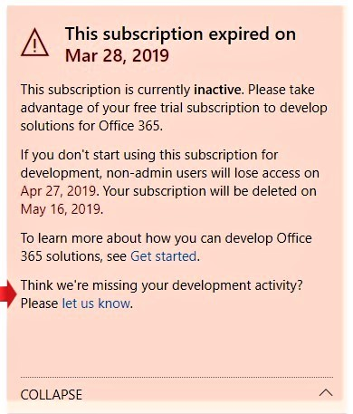
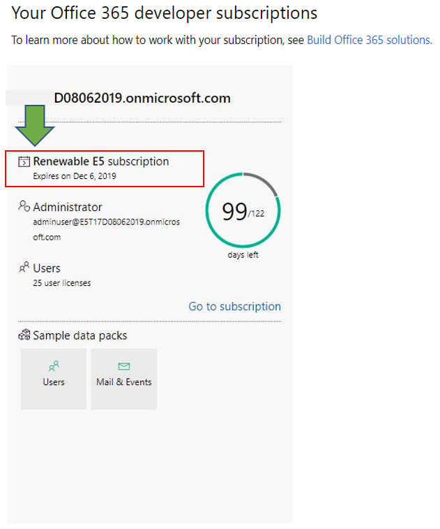

# Office 365 Developer Program FAQ

The following are frequently asked questions about the Office 365 Developer Program.

## What is the Office 365 Developer Program and who should join it?

The Office 365 Developer Program is designed to help you build people-centric, cross-platform productivity experiences that extend Office 365. Join our program to get access to the tools, documentation, training, experts, and community events that you need to build great solutions for Office 365 products and technologies, including:

- [Excel](https://developer.microsoft.com/excel), [Outlook](https://developer.microsoft.com/outlook), [Word](https://developer.microsoft.com/word), and [PowerPoint](https://developer.microsoft.com/powerpoint) web add-ins
- [SharePoint](https://developer.microsoft.com/sharepoint)
- [Microsoft Teams](https://developer.microsoft.com/microsoft-teams)
- [Microsoft Graph](https://developer.microsoft.com/graph)

As a program member, you can get a free Office 365 developer subscription with 25 user licenses to use to build your solutions. This subscription will remain active for as long as you’re actively developing and deploying solutions.

For more information, see [Join the Office 365 Developer Program](office-365-developer-program.md) and [Build Office 365 solutions](build-office-365-solutions.md).
 
## How does the Office 365 developer subscription work?  

If you join the Office 365 Developer Program, you qualify to get a free Office 365 developer subscription. This is a special subscription designed to be used for application development only, and comes with 25 user licenses. 

After joining the Office 365 Developer Program, you'll have the option to receive and configure an Office 365 developer subscription. Your subscription is good for 90 days and can be renewed for another 90 days for as long as you're using it for development activity. 

For more information, see [Set up an Office 365 developer subscription](office-365-developer-program-get-started.md).

## How many user licenses can I add with my subscription?

You can add up to 25 user licenses, including the administrator, for development purposes only. Using this subscription for any purpose other than application development is a violation of the license agreement. For more details about the licensing restrictions, see the [Office 365 developer subscription terms of use](terms-and-conditions.md).

## Why don’t you offer a one-year subscription?

In April 2019, we transitioned to a new model where your subscription can be renewed perpetually every 90 days if you're actively using it for development. We believe that this model ensures that developers who are actively developing solutions have a subscription for as long as they need one. If you're developing frequently, your subscription never expires; it is automatically extended. If you're developing for a short time, and your subscription expires and is deleted, you can sign up for a new one. 

If you prefer to have a subscription that is available for a longer time, we recommend that you get the Visual Studio Professional or Visual Studio Enterprise subscription. These programs include a free Office 365 developer subscription that is good for the life of your Visual Studio subscription. To access this, go to [Visual Studio | My Benefits](https://my.visualstudio.com/benefits). For more information, contact [Visual Studio customer service](https://www.visualstudio.com/subscriptions/support/). 

## How do you determine whether a subscription can be renewed?

We use a set of algorithms and telemetry that we get from your activity in the Office 365 Developer Program and on your Office 365 developer subscription to determine whether you are actively developing. We check these regularly to update your status and determine whether your subscription should be extended. 

If you think we somehow missed tracking your development activity accurately, you can let us know via your dashboard. To submit a form that tells us how you are using your subscription for development, in the dashboard warning, choose the **Let us know** link, as shown in the following image. We will review your request and let you know if you qualify for an extension. 

 

## How do you define development activity?

Your activity in the Office 365 Developer Program and on your Office 365 developer subscription determine whether you are actively developing and whether your subscription should be extended. 

## What development activities do you track?

For more information about the types of activities that we track, see the [Office 365 developer subscription terms of use](terms-and-conditions.md). 

## What's included in the developer subscription?
If you created your subscription after August 25, 2019, you have a Microsoft 365 E5 Developer subscription with 25 user licenses. Customers who joined the program before August 25, 2019, have an Office 365 E3 Developer subscription with 25 user licenses.

The Office 365 E3 Developer subscription includes the following:

- [Exchange Online (Plan 2)](https://products.office.com/exchange/compare-microsoft-exchange-online-plans)
- [Flow for Office 365](https://flow.microsoft.com/pricing/)
- [Information Protection for Office 365 - Standard](https://products.office.com/en-us/business/azure-information-protection-for-office-365)
- [Microsoft Forms (Plan E5)](https://support.office.com/article/Frequently-asked-questions-about-Microsoft-Forms-495c4242-6102-40a0-add8-df05ed6af61c)
- [Microsoft Planner](https://products.office.com/compare-all-microsoft-office-products?tab=2)
- [Microsoft Search](https://products.office.com/en-us/business/intelligent-search?tab=Discovery)
- [Microsoft Stream for Office 365 E5 SKU](https://products.office.com/business/office-365-enterprise-e5-business-software)
- [Microsoft Teams](https://products.office.com/business/office-365-enterprise-e5-business-software)
- [Mobile Device Management for Office 365](https://support.office.com/article/Set-up-Mobile-Device-Management-MDM-in-Office-365-dd892318-bc44-4eb1-af00-9db5430be3cd)
- [Office 365 ProPlus](https://products.office.com/business/office-365-proplus-business-software)
- [Office for the web](https://docs.microsoft.com/en-us/office365/servicedescriptions/office-online-service-description/office-online-service-description)
- [PowerApps for Office 365](https://powerapps.microsoft.com/pricing/)
- [SharePoint Online for Developer](https://products.office.com/SharePoint/compare-sharepoint-plans)
- [Skype for Business Online (Plan 2)](https://products.office.com/skype-for-business/online-meeting-solutions)
- [Sway](https://sway.com/)
- [To-Do (Plan 3)](https://todo.microsoft.com)
- [Whiteboard (Plan 2)](https://products.office.com/en-us/microsoft-whiteboard/digital-whiteboard-app)

The Microsoft 365 E5 Developer subscription includes all the apps that are included in the Office 365 E3 Developer subscription, plus the following new features:  

- Advanced analytics with Power BI  
- Enterprise Mobility + Security (EMS) for compliance and information protection  
- Office 365 Advanced Threat Protection 
- Azure Active Directory for building advanced identity and access management solutions  

The Microsoft 365 E5 Developer subscription includes the following: 

- Azure Active Directory Premium P1 
- Azure Active Directory Premium P2 
-	Azure Advanced Threat Protection 
-	Azure Information Protection Premium P1 
-	Azure Information Protection Premium P2 
-	Customer Lockbox 
-	Exchange Online (Plan 2) 
-	Flow for Office 365 
-	Information Protection for Office 365 - Premium 
-	Information Protection for Office 365 - Standard 
-	Microsoft Azure Active Directory Rights 
-	Microsoft Azure Multi-Factor Authentication 
-	Microsoft Cloud App Security 
-	Microsoft Forms (Plan E5) 
-	Microsoft Intune 
-	Microsoft MyAnalytics (Full) 
-	Microsoft Planner 
-	Microsoft StaffHub 
-	Microsoft Stream for O365 E5 SKU 
-	Microsoft Teams 
-	Mobile Device Management for Office 365 
-	Office 365 Advanced eDiscovery 
-	Office 365 Advanced Security Management 
-	Office 365 Advanced Threat Protection (Plan 1) 
-	Office 365 Advanced Threat Protection (Plan 2) 
-	Office 365 Privileged Access Management 
-	Office 365 ProPlus 
-	Office Online 
-	Phone System 
-	Power BI Pro 
-	PowerApps for Office 365 Plan 3 
-	SharePoint Online (Plan 2) 
-	Skype for Business Online (Plan 2) 
-	Sway 
-	To-Do (Plan 3) 
-	Whiteboard (Plan 3) 
-	Yammer Enterprise 

## How do I know which subscription I have?

You can determine whether you have a Microsoft 365 E5 subscription or an Office 365 E3 subscription on the subscription tile on your [dashboard](https://developer.microsoft.com/office/profile). The tile will show either E3 or E5 under the subscription domain name.

.

## How can I migrate from an Office 365 E3 subscription to a Microsoft 365 E5 subscription?

Currently, only new Office 365 Developer Program members will get a Microsoft 365 E5 Developer subscription automatically. Existing users will be offered a way to migrate to a Microsoft 365 E5 subscription in the future. Rest assured, we are working to enable all Office 365 Developer Program members to migrate to Microsoft 365 E5. 

## Can I choose whether to have an Office 365 E3 or a Microsoft 365 E5 subscription?

Currently, only new Developer Program members are offered a Microsoft 365 E5 subscription. Existing members with an Office 365 E3 subscription will have the option to keep their current subscription and continue to renew it if they don't need the new capibilities offered in Microsoft 365 E5. Developer program members can only have one subscription.  

When we have a migration option for existing Developer Program members, we’ll provide more information about how to migrate. 

## Does the subscription also include a subscription to Azure?

This offer does not include a subscription to Azure. However, to receive free access to Azure services, you can [create a free Azure account](https://azure.microsoft.com/free/). 

## How long is my subscription good for, and when does it expire?

Your subscription is good for 90 days and is renewable based on valid developer activity. If you're using your subscription for development, it will be renewed every 3 months and will last indefinitely. You can find the expiration date, along with your subscription name, on your [Office 365 Developer Program dashboard](https://developer.microsoft.com/en-us/office/profile). For more information, see [Subscription expiration and renewal](subscription-expiration-and-renewal.md).

If you're joining the program through Visual Studio Enterprise or Visual Studio Professional, your subscription is automatically renewed until your Visual Studio subscription expires. 

## When my subscription is about to expire, can I extend it?

The only way that you can extend your subscription is to do valid developer activity. If you're using your subscription to develop custom solutions, your subscription will expire and will eventually be deleted. 

For more information, see [Subscription expiration and renewal](subscription-expiration-and-renewal.md).

## If my subscription is going to expire, how much time do I have before it is deleted?

You have 30 days after your subscription expires to migrate any data. For the next 30 days, only the admin will have access to the subscription, and on day 60, the subscription and all data will be deleted.

## What account can I use to sign up for the Office 365 Developer Program?

You can sign up for the developer program by using one of the following account types:

- **Microsoft account** (created by you for personal use) - Provides access to all consumer-oriented Microsoft products and cloud services, such as Outlook (Hotmail), Messenger, OneDrive, MSN, Xbox Live, or Office 365. Signing up for an Outlook.com mailbox automatically creates a Microsoft account. After a Microsoft account is created, it can be used to access consumer-related Microsoft cloud services or Azure. 
- **Work account** (issued by an admin for business use) - Provides access to all small, medium, and enterprise business-level Microsoft cloud services, such as Azure, Microsoft Intune, or Office 365. When you sign up to one of these services as an organization, a cloud-based directory is automatically provisioned in Azure Active Directory to represent your organization. For more information, see [Manage your Azure AD directory](https://docs.microsoft.com/azure/active-directory/active-directory-administer).
- **Visual Studio ID** (created for your Visual Studio Professional or Enterprise subscriptions) - We recommend that you use this option to join the developer program from within the Visual Studio Gallery to get the full benefits as a Visual Studio subscriber. 
 
## As a Microsoft Partner, can I receive a subscription? 

Yes, you can follow [these instructions](office-365-developer-program.md) to join the Office 365 Developer Program and set up an Office 365 developer subscription. However, if you already have a Visual Studio Enterprise or Visual Studio Professional (MSDN) subscription, you can get an Office 365 developer subscription as a benefit. To access this, go to [Visual Studio | My Benefits](https://my.visualstudio.com/benefits). For more information, contact [Visual Studio customer service](https://www.visualstudio.com/subscriptions/support/). 

## As a full-time Microsoft employee, can I receive a subscription?

Microsoft employees cannot sign up for this offer. However, all Microsoft full-time employees have access to a free Visual Studio (MSDN) subscription that includes access to Office E3 Developer. You can access this benefit at [Visual Studio | My Benefits](https://my.visualstudio.com/benefits).

## As a vendor working at Microsoft, do I qualify for a subscription?

Yes, you can follow [these instructions](office-365-developer-program.md) to join the Office 365 Developer Program and set up an Office 365 developer subscription. But even for vendors, this subscription is designed to be used _for application development only_. If you are not doing valid development activity, your subscription will not be renewed.

## Is the Office 365 Developer Program available in my language?

In addition to English, the Office 365 Developer Program is available in the following languages: Chinese (Simplified), French, German, Japanese, Portuguese (Brazil), Russian, and Spanish.

## Is the Office 365 developer subscription available in my language?

The Office 365 developer subscription is only offered in English.

## Support

If you have issues setting up your subscription, see the following support resources:

- [Stack Overflow](https://stackoverflow.com/questions)   
- [Visual Studio customer service](https://www.visualstudio.com/subscriptions/support/)

## See also

- [Join the Office 365 Developer Program](office-365-developer-program.md)
- [Set up an Office 365 developer subscription](office-365-developer-program-get-started.md)
- [Use your subscription to build Office 365 solutions](build-office-365-solutions.md)
- [Renew an expiring subscription](subscription-expiration-and-renewal.md)

 

 

 

 

 

 
