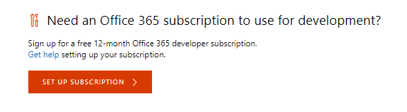
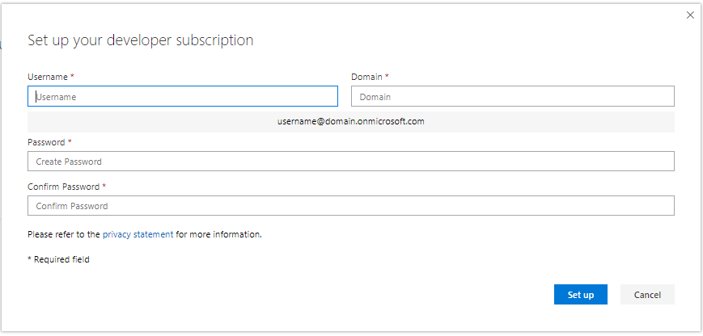
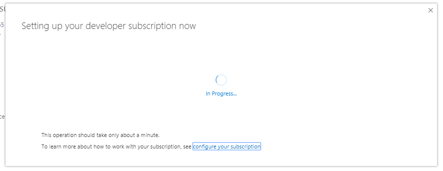
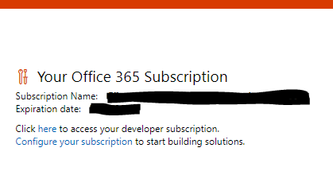
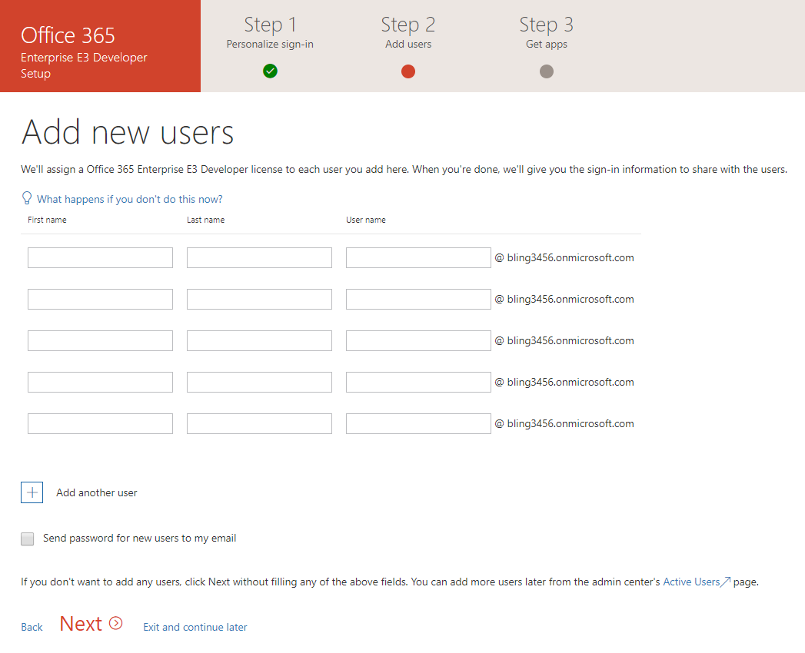
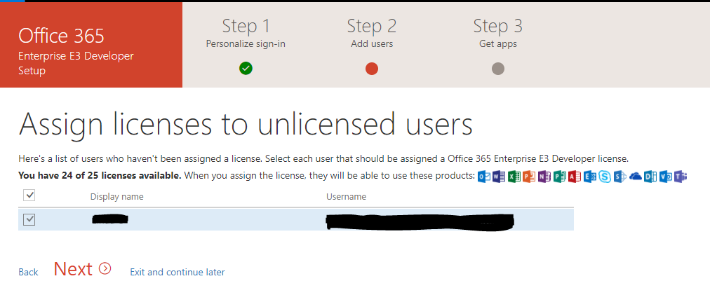
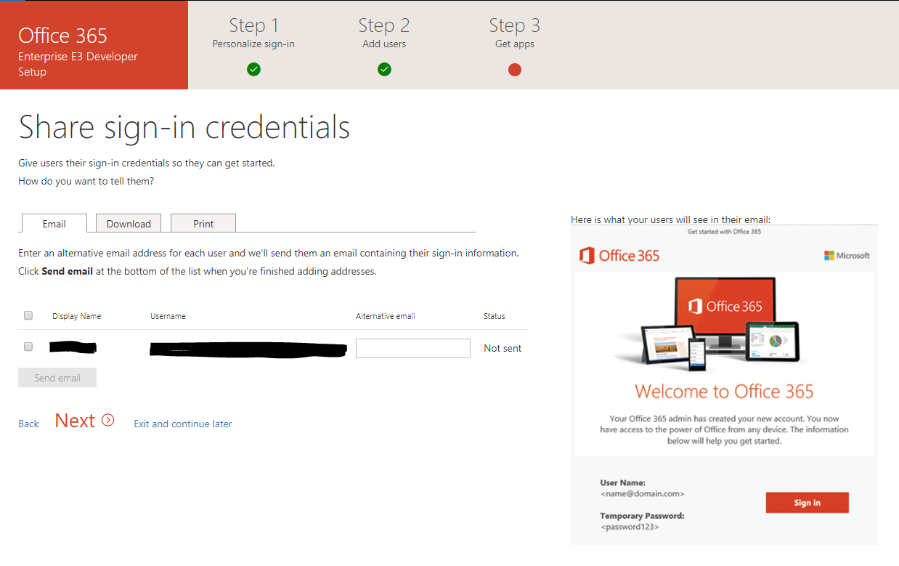
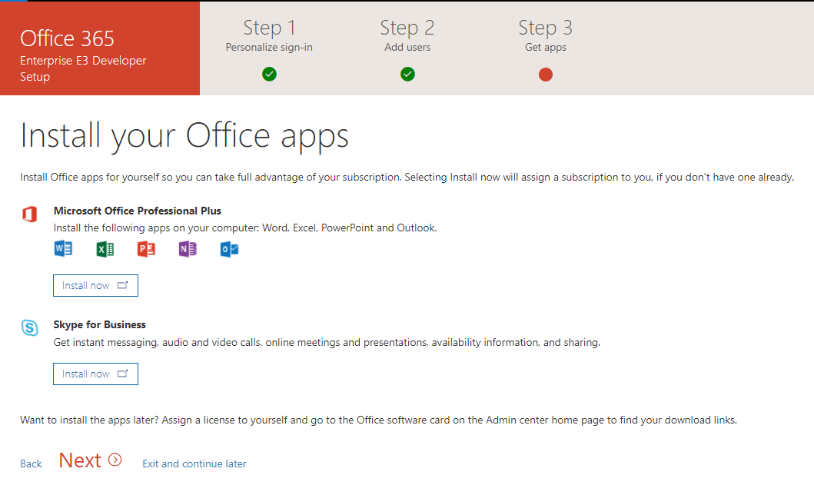
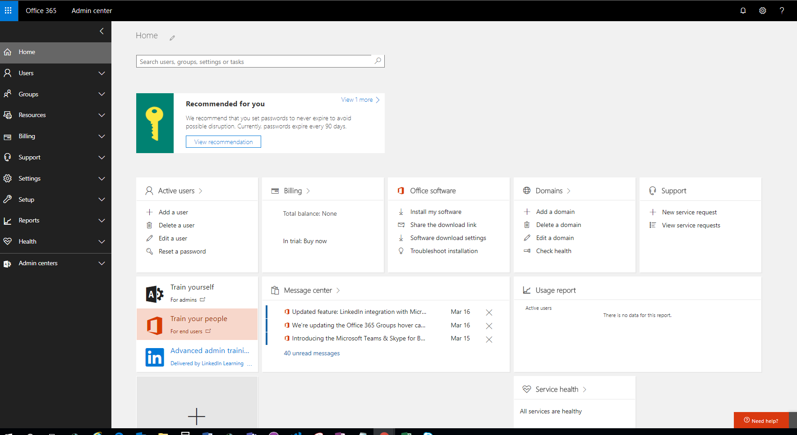

# Set up an Office 365 developer subscription 

Set up an Office 365 developer subscription to build and test your solutions independent of your production environment. The subscription is an Office 365 Enterprise E3 Developer subscription with 25 user licenses. It lasts for one year and is free to use for development purposes (coding and testing solutions).

> [!NOTE] 
> To set up a subscription, you must first [join the Office 365 Developer Program](office-365-developer-program.md). After joining, you'll see the option to set up a subscription.

## Set up your subscription

1. To get an Office 365 developer subscription, on your profile page, under **Need an Office 365 subscription to use for development?**, choose **Set up subscription**.

  

2. In the **Set up your developer subscription** dialog box, create a username and domain. This account will have global administrator permissions for the subscription. You can choose any username or domain name as long as it is not already in use. Do not use spaces.

  

3. Create and confirm a password.

4. Choose **Set up**.

5. If you are asked to prove you're not a robot, follow the instructions, and then choose **Verify**.

  

6. After the subscription is created, your subscription name and expiration date appear on your profile page.

   > [!IMPORTANT]
   > Make a note of your username and password because you'll need it to access your developer subscription.

  

## Configure the subscription

1. On your profile page, click the "here" link to access your developer subscription, and sign in with your new user name and password.

   > [!NOTE] 
   > On subsequent visits to the Dashboard, sign in with your *username@domain*.onmicrosoft.com account before you go to the Dashboard.
   
2. Follow the instructions to assign products or install Office apps.

   > [!NOTE] 
   > At this time, the subscription's region defaults to North America regardless of which country/region you are in. You can still proceed with setting up and using your developer subscription.

3. Add users.

  For many scenarios, you'll need to test with user accounts with different permissions and settings. You can add up to 25 user accounts with your subscription. To add users, see [Add users individually or in bulk to Office 365 - Admin Help](https://support.office.com/en-us/article/add-users-individually-or-in-bulk-to-office-365-admin-help-1970f7d6-03b5-442f-b385-5880b9c256ec).

  

4. Assign licenses.

  

5. Share sign-in credentials.

  

6. Install Office apps.

  

7. Use the Admin center.

  

## Provision Office 365 services

It will take some time for the backend services, such as SharePoint and Exchange, to provision for the subscription. During this step, some of the icons in the app launcher and on the Home page show as **Setting up (This app is still being set up)**. This will take no longer than an hour.

When the provisioning is complete, you can use the new Office 365 subscription for development and testing. The subscription expires after one year.

We also recommend that you enable release options to ensure that you get access to the latest Office 365 features as soon as possible. For more information, see [Set up the Standard or Targeted release options in Office 365](https://support.office.com/en-us/article/set-up-the-standard-or-targeted-release-options-in-office-365-3b3adfa4-1777-4ff0-b606-fb8732101f47?ui=en-US&rs=en-US&ad=US).

## Set up a Microsoft Azure account

For some Office solutions, you might need a Microsoft Azure account to build and test using Azure services. To set up a free Azure account, see [Create your Azure free account today](https://azure.microsoft.com/en-us/free/).

## Leave the Developer Program

If you decide that you no longer want to participate in the Office 365 Developer Program, you can end your subscription and leave the program.

  > [!WARNING]
  > The following steps will erase all of your profile information. You will lose any data stored in your developer subscription that is not backed up elsewhere.

1. Sign in to the Developer Program.

2. Choose **Delete Profile**.

3. In the **Delete Profile** confirmation box, choose **Delete**.

## See also

- [Join the Office 365 Developer Program](office-365-developer-program.md)
- [Configure your subscription to build Office 365 solutions](configure-your-office-365-developer-subscription.md)
- [Office 365 Developer Program FAQ](office-365-developer-program-faq.md)
