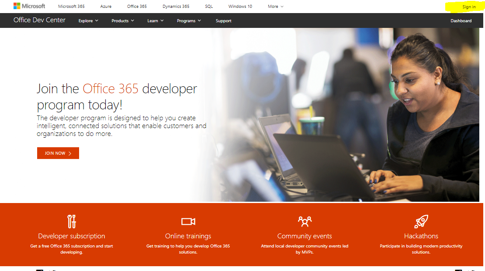
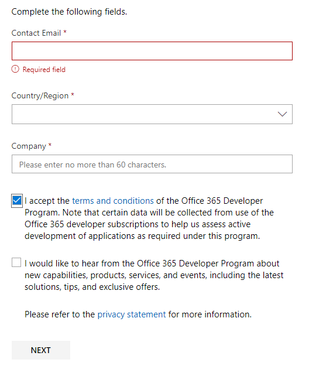
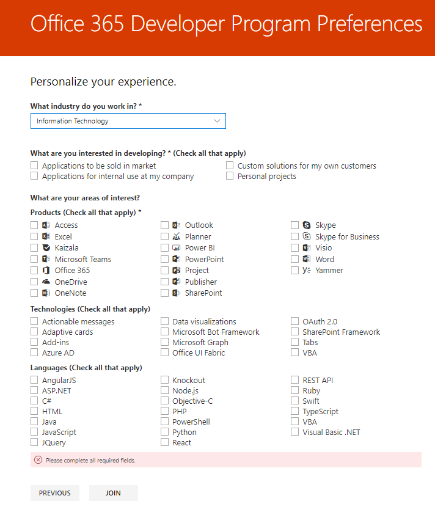
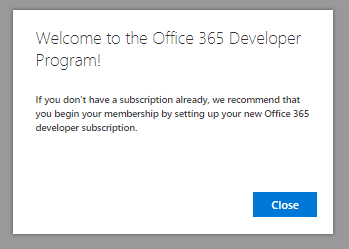

# Welcome to the Office 365 Developer Program

Join your friends and colleagues in the Office 365 Developer Program. Use the Office 365 developer subscription to develop and test your solutions independent of your production environment. You can build solutions for Microsoft Teams, Office Add-ins, Microsoft Graph, SharePoint Framework, SharePoint Add-ins, and more.

## Join the Office 365 Developer Program

1. Go to the [Join the Office 365 Developer Program](https://developer.microsoft.com/en-us/office/dev-program) page. 

2. In the upper-right corner, choose **Sign in** to sign in with your Microsoft account or Azure Active Directory-enabled email. 

  

3. After signing in, choose **Join now**.

4. On the **Office 365 Developer Program Signup** page, complete the following fields in the online form:

  - **Contact Email**
  - **Country/Region**
  - **Company**

  

5. Review the **terms and conditions**. You'll need to select the check box before you can join.

6. Optionally, select the **I would like to hear from the Office 365 Developer Program** check box if you want to hear from Microsoft about new capabilities and other updates. 

7. Choose **Next**.

8. On the **Office 365 Developer Program Preferences** page, tell us your preferences so we can personalize your experience, including:

  - The industry that you work in.
  - The type of applications or solutions you're interested in developing.
  - Products, technologies, and programming languages that you're interested in.

  

9. When you're finished, choose **Join**. Your preferences appear on the next page in the top right, and you receive a Welcome message.

  

## Next steps

- [Set up an Office 365 developer subscription](office-365-developer-program-get-started.md). 

- After you have your developer subscription, [configure your subscription](configure-your-office-365-developer-subscription.md) to build the types of solutions that you want.

- For frequently asked questions about the Office 365 Developer Program, see the [FAQ](office-365-developer-program-faq.md). 
