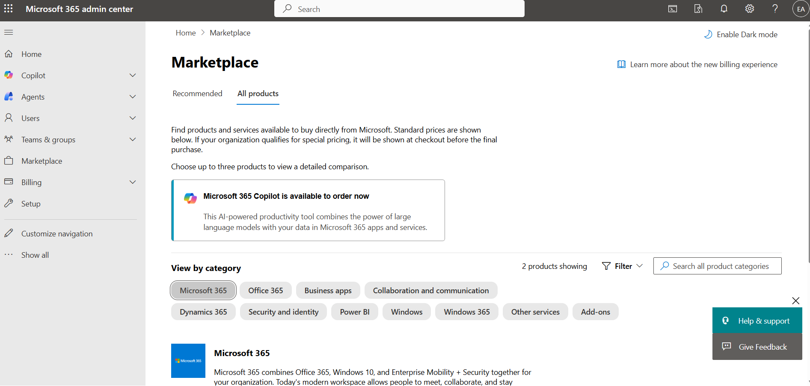
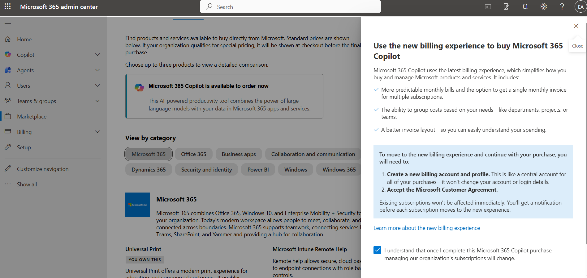
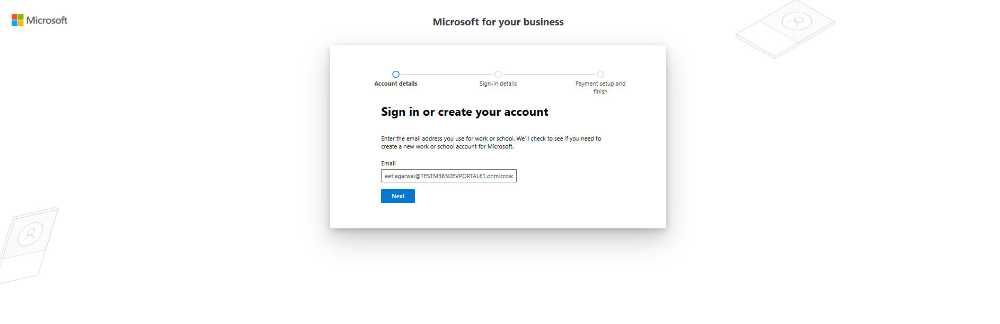
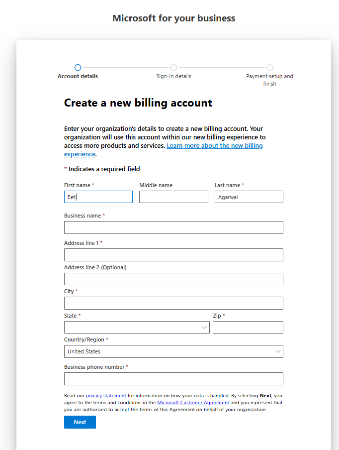
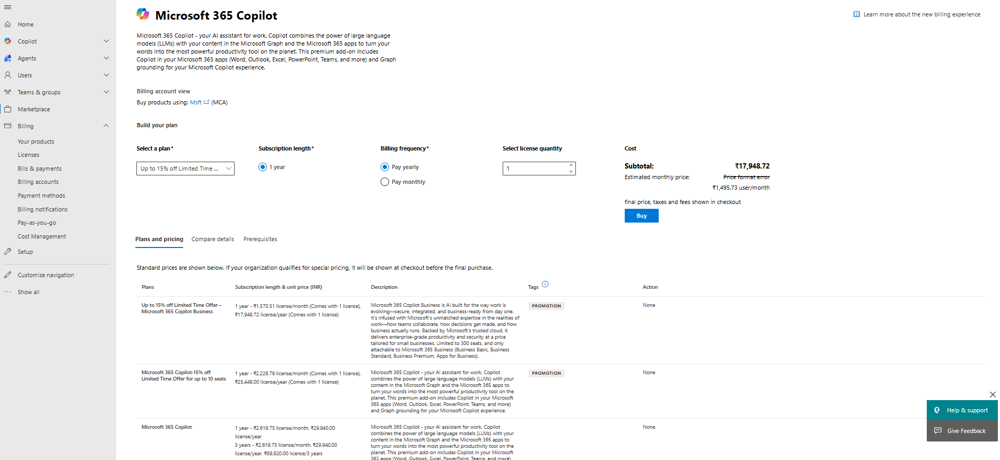
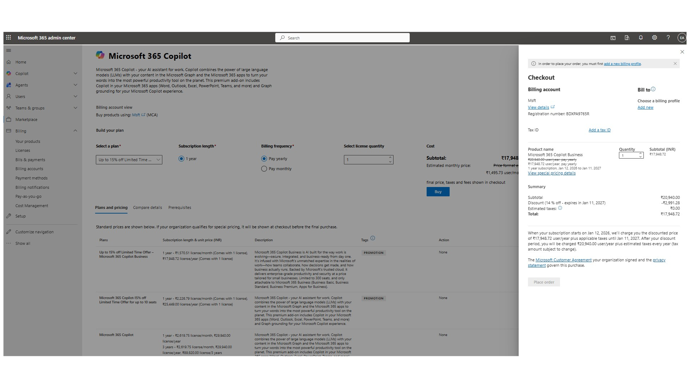
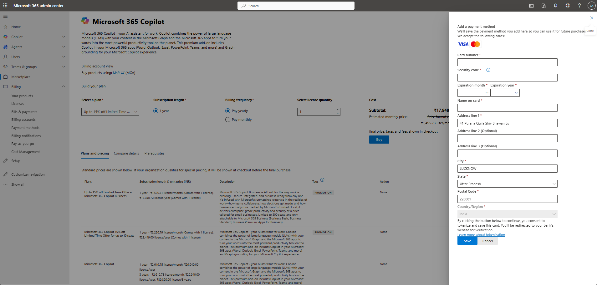
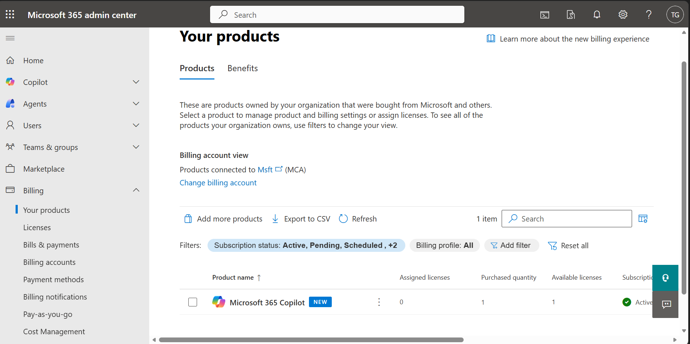

---

title: Purchase Copilot licenses from your M365 Developer Program sandbox
description: Learn how to purchase a Copilot license from your M365 Developer Program sandbox
ms.date: 07/30/2026
ms.localizationpriority: high

---

# Purchase Copilot licenses from your M365 Developer Program sandbox

> [!NOTE]
> Instant sandboxes issued to eligible customers with enterprise accounts starting July 2026 include add-on commerce capability, so you can purchase additional paid licenses and services including Microsoft 365 Copilot directly from within the sandbox. For more information, see [Instant sandbox](microsoft-365-developer-program-get-started.md#instant-sandbox).

## Prerequisites

Before you begin, ensure you have:

- An active M365 Developer Program sandbox.
- Global Admin credentials for your Developer Program sandbox.
- A valid payment method to purchase your license.

## Step 1: Sign in to the Microsoft 365 admin center

1. Navigate to the [Microsoft 365 admin center](https://admin.microsoft.com/).
2. Sign in using your Global Admin credentials for your Developer Program sandbox (for example, abc@xyz123.onmicrosoft.com).

> [!NOTE]
> You can find your login email on your Developer Program dashboard.

## Step 2: Navigate to the Copilot product page

1. In the left-hand navigation menu, select **Marketplace** > **All products**.
2. Use the search bar to find Microsoft 365 Copilot.

## Step 3: Create a billing account

When you select Microsoft 365 Copilot, you'll see a prompt to create a new billing account.

1. Select **Create a new billing account**.

    

2. Enter your email address.

    > [!IMPORTANT]
    > You must use the same email address as your Developer Program Global Admin to correctly link the billing account to your Developer Program.

    

3. Enter your work communication address.

    

4. After your address is validated, you'll be redirected back to the admin center.

## Step 4: Select your license plan

1. Choose the number of licenses you want to purchase.
2. Select your preferred Microsoft 365 Copilot plan.
3. Select **Buy** to proceed to checkout.

    

## Step 5: Complete your purchase

1. On the checkout page, select **Create a new billing profile** in the top-right corner.

    

2. Enter your billing details and payment information.

    

3. Complete the purchase. After the purchase is complete, Microsoft 365 Copilot will appear under **Billing** > **Your products**.

    

## Step 6: Assign licenses to users

1. In the admin center, navigate to **Users** > **Active users**.
2. Select the user you want to assign a license to.
3. Select **Manage product licenses**.
4. Enable **Microsoft 365 Copilot** for the selected user.
5. Save your changes.

## Next steps

After assigning licenses, users may need to:

- Sign out and sign back in to their Microsoft 365 applications to activate Copilot.
- Review [Microsoft 365 Copilot documentation](https://support.microsoft.com/copilot) to learn how to use the features.

## Additional resources

- [Set up a Microsoft 365 developer sandbox subscription](microsoft-365-developer-program-get-started.md)
- [Microsoft 365 Developer Program FAQ](microsoft-365-developer-program-faq.yml)
- [Microsoft 365 Developer Program](https://developer.microsoft.com/microsoft-365/dev-program)
- [Assign licenses to users in Microsoft 365](/microsoft-365/admin/manage/assign-licenses-to-users)
- [Microsoft 365 Copilot documentation](https://support.microsoft.com/copilot)
