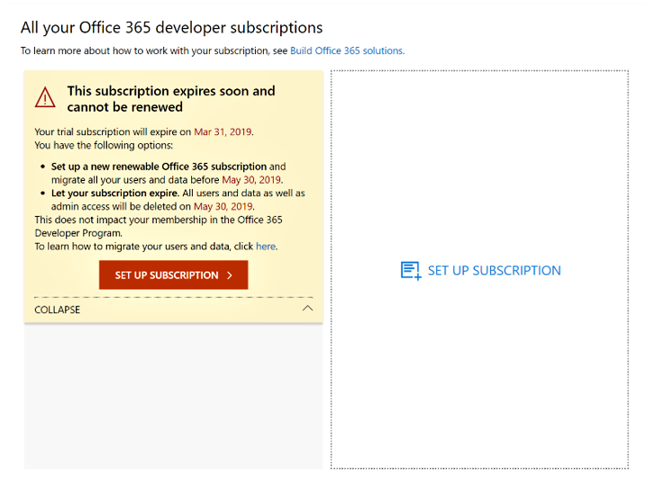
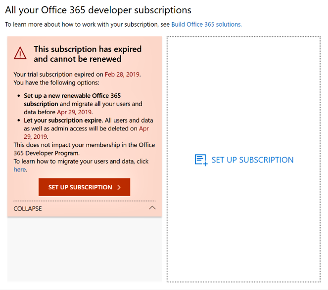
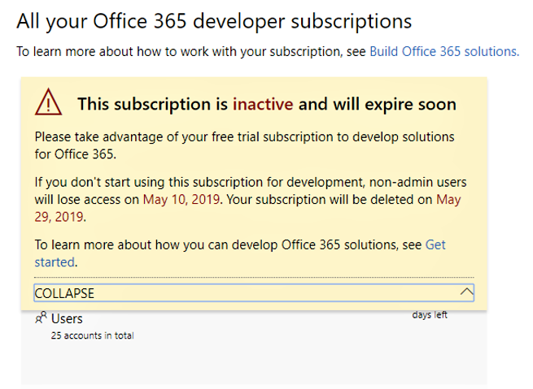
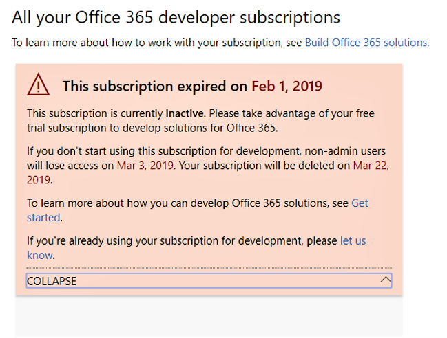
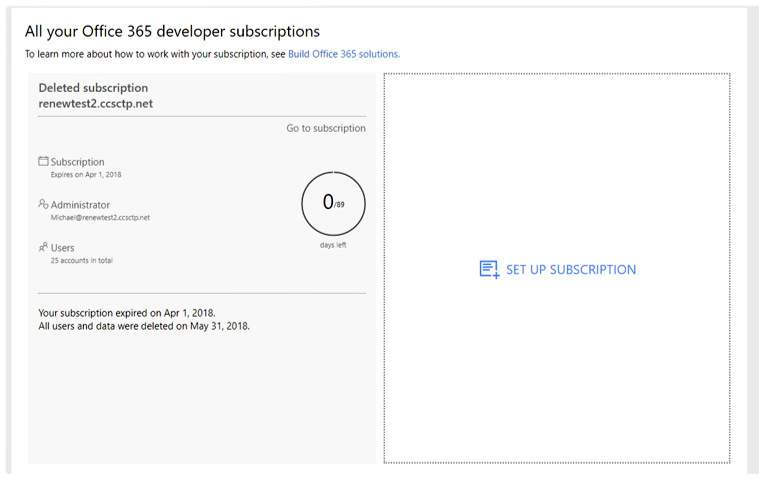

# Microsoft 365 Developer Program subscription expiration and renewal

Your Microsoft 365 Developer Program membership includes a free Office 365 E3 or Microsoft 365 E5 developer subscription. Your developer subscription is renewable based on your development activity; however, some older subscriptions do expire. This article describes the difference between renewable and non-renewable subscriptions and how to update your subscription if it expires.

## Expiring vs. renewable developer subscriptions

With the launch of the Microsoft 365 Developer Program, we offered 12-month developer subscriptions that expire and cannot be renewed. In August 2018, we started providing renewable subscriptions to some developer program members.

Starting in April 2019, we offer renewable 90-day subscriptions.

You can determine whether you have a renewable or non-renewable subscription by viewing your [Microsoft 365 Developer Program dashboard](https://aka.ms/DevProgramDashboard).

## Non-renewable subscriptions

If you signed up for your subscription before August 2018, your subscription is not renewable, and you'll see the following warning on your dashboard. You'll need to replace your subscription before your current one expires. The warning text will indicate that the subscription cannot be renewed. We'll also email you to remind you that your subscription is expiring.
 
 

When your subscription expires, you'll see the following warning text.

 

To create a replacement subscription, choose **Set Up Subscription**. 

You'll also need to migrate any important data that you need to save to your new subscription. For details, see [How do I migrate my data?](#migrate-data) later in this topic.

## Renewable subscriptions

If you signed up for your subscription after August 2018, you might have a renewable subscription. If your subscription is inactive, you'll see the following warning on your dashboard. 

 

When your subscription expires, you'll see the following warning text.

 

If you're an active developer, your subscription will be renewed automatically for another 90 days from the original date of expiration. 

## Why isn't my current subscription renewable?

We introduced renewable subscriptions in August 2018. If you signed up for your subscription before then, your subscription is not renewable and you'll need to set up a new one when it expires.

## How do I migrate my data when my subscription expires?

To migrate your data from your current subscription to a new subscription, see the following resources:

- [How to migrate mailboxes from one tenant to another](/exchange/mailbox-migration/migrate-mailboxes-across-tenants)
- [Use PowerShell to perform a staged migration](/office365/enterprise/powershell/use-powershell-to-perform-a-staged-migration-to-office-365)
- [Migration from one subscription to another without third party](https://social.technet.microsoft.com/Forums/en-US/ee507441-eb91-4b0a-ba6c-5bd9bb8c71b1/migration-from-one-o365-tenant-to-another-o365-without-third-party?forum=onlineservicesmigrationandcoexistence)

## How do I know if my subscription was deleted?

When your subscription is deleted, you will see a notification on your dashboard that the subscription and its ID were deleted, as shown in the following screenshot. 

 

## See also

- [Join the Microsoft 365 Developer Program](microsoft-365-developer-program.md)
- [Set up a Microsoft 365 developer subscription](microsoft-365-developer-program-get-started.md)
- [Use your subscription to build Microsoft 365 solutions](build-microsoft-365-solutions.md)
- [Microsoft 365 Developer Program FAQ](microsoft-365-developer-program-faq.yml)

